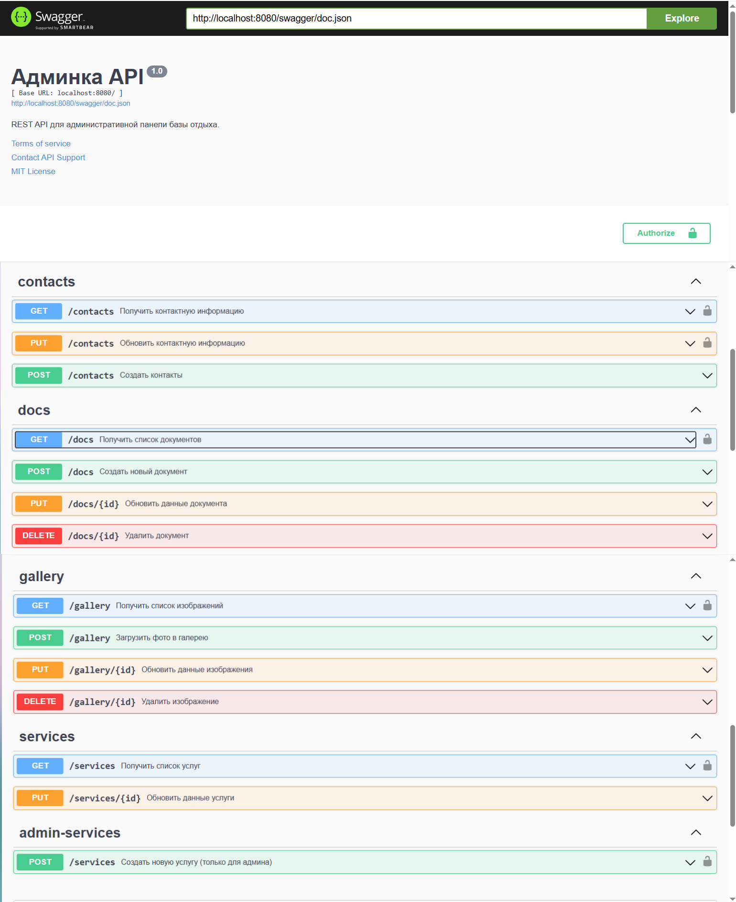

# Админка — Бэкенд на Go

Чистый REST API для административной панели базы отдыха.  
Работает с PostgreSQL и предоставляет CRUD-интерфейс для управления контентом.

Работает в связке с React-фронтендом, но является независимым сервисом.

## 🚀 Технологии

- **Язык**: Go 1.25+
- **Фреймворк**: net/http + GORM
- **База данных**: PostgreSQL (через Docker)
- **Контейнеризация**: Docker
- **Хранение файлов**: локальная папка `/uploads`
- **Документация**: Swagger (OpenAPI)

## 🔧 Запуск проекта

### 1. Установите зависимости

Убедитесь, что у вас установлено:
- [Docker Desktop](https://www.docker.com/products/docker-desktop)
- [Go 1.25+](https://go.dev/dl/)

### 2. Запустите PostgreSQL через Docker

```bash
docker compose up -d

Это запустит PostgreSQL с параметрами:

[Пользователь]: admin
[Пароль]: adminpass
[БД]: admin_api
[Порт]: 5432

### 3. Запустите бэкенд

```bash
go run main.go
Сервер будет доступен по адресу:
👉 http://localhost:8080


🛠 API Endpoints


Метод  | URL           | Описание 

GET    | /services     | Получить услуги
PUT    | /services/:id | Обновить услугу
GET    | /gallery      | Получить галерею
POST   | /gallery      | Загрузить фото
PUT    | /gallery/:id  | Обновить фото
DELETE | /gallery/:id  | Удалить фото
GET    | /docs         | Получить документы
POST   | /docs         | Загрузить PDF/DOC
PUT    | /docs/:id     | Обновить документ
DELETE | /docs/:id     | Удалить документ
GET    | /contacts     | Получить данные контактов
PUT    | /contacts     | Обновить контакты

Статические файлы (изображения) доступны по:
👉 http://localhost:8080/uploads/photo.jpg

 ✅ Все данные хранятся в PostgreSQL  
 ✅ Изображения сохраняются в папке `./uploads`  
 ✅ Поддержка CORS для фронтенда на React

🛠 Для разработчиков
Используйте Thunder Client или Postman для тестирования.

Пример POST /gallery:

Method: POST
URL: http://localhost:8080/gallery
Format: multipart/form-data
Key: files → выберите файл(ы)

Логи
При запуске вы увидите:

Server started at :8080
Если есть ошибки подключения к БД — проверьте, запущен ли Docker.

📚 API Documentation (Swagger)

Перед запуском сервера сгенерируйте документацию:
```bash
swag init -g main.go -o ./docs

Затем запустите сервер:
```bash
go run main.go


Полная документация API доступна через Swagger UI:



Каждый метод содержит:
- Описание
- Параметры
- Примеры ответов
- Возможные ошибки

> 💡 Перейдите на [http://localhost:8080/swagger/index.html](http://localhost:8080/swagger/index.html) и нажмите "Try it out" для тестирования.

Там вы можете:
- Просмотреть все эндпоинты
- Увидеть параметры запросов и ответов
- Протестировать API прямо в браузере

> 💡 Подсказка: используйте `POST /gallery` для загрузки фото или `PUT /contacts` для обновления данных.


🏁 Автор
[Юлия Вовк] — Fullstack-разработчик
Portfolio: [GitHub](https://github.com/yulya-vovk)

📄 Лицензия
MIT License

Copyright (c) 2025 Юлия Вовк

См. полный текст лицензии: LICENSE
